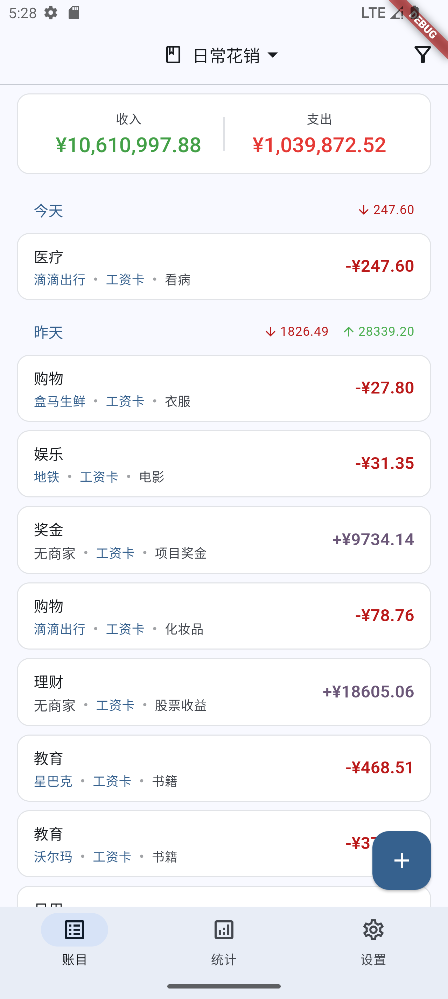
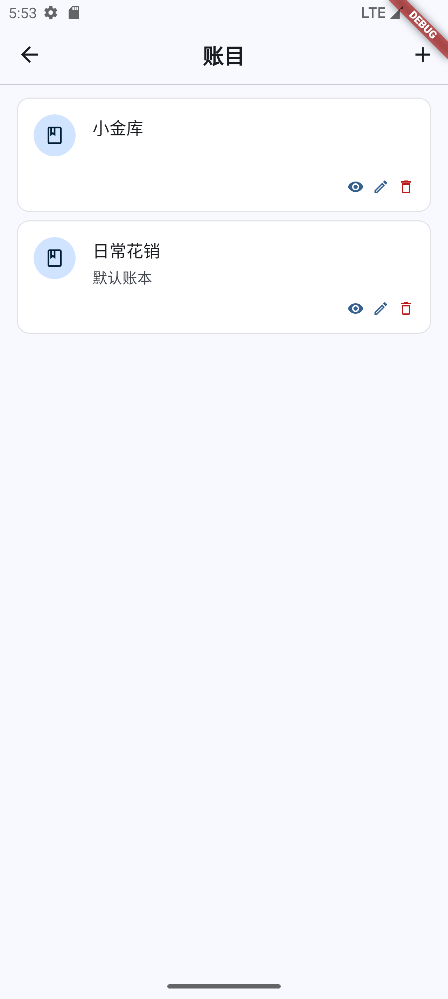
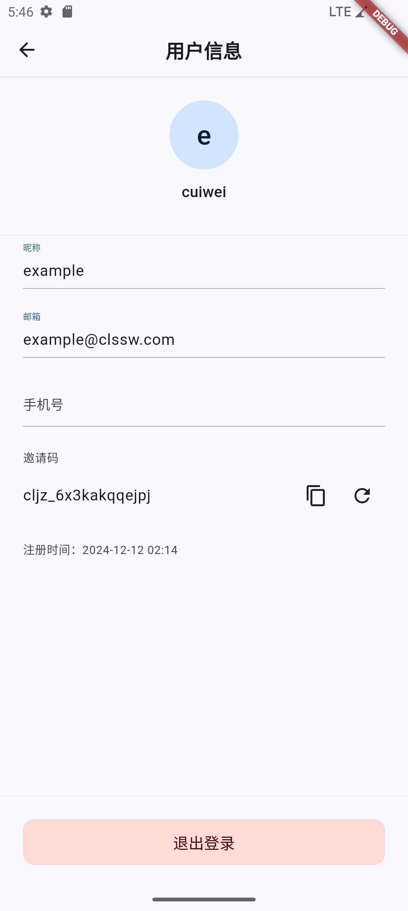
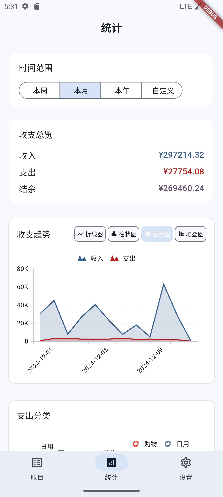

# Account Book App

## [中文说明](./README_CN.md)

A cross-platform finance management application built with Flutter(Support English,Simple Chinese,Traditional Chinese). This is the frontend implementation of [clsswjz-server](https://github.com/clssw1004/clsswjz-server), supporting multiple account books, collaboration, and fund account management.

## Download & Install

Visit [Releases](https://github.com/clssw1004/clsswjz-app/releases) page to download the latest version:

### Android

- Download `clsswjz-{version}-android-arm64.apk`
- Allow installation from unknown sources
- Install the APK file directly

### Windows

- Download `clsswjz-{version}-windows-x64.zip`
- Extract to any directory
- Run `clsswjz.exe`

### Linux

- Download `clsswjz-{version}-linux-x64.zip`
- Extract to any directory
- Add execution permission: `chmod +x clsswjz`
- Run: `./clsswjz`

## Features

### Transaction Management

- Income/Expense recording
- Custom category management
- Merchant management
- Fund account management
- Multiple account books
- Transaction filtering and search

### Account Book Management

- Create and manage multiple account books
- Member permission management
- Book sharing and collaboration
- Default book setting

### User System

- User registration and login
- Profile management
- Invitation code system
- Backend service configuration

### Statistics & Analysis

- Income/Expense overview
- Category statistics
- Trend analysis
- Custom time range

## Technical Features

- Material Design 3 compliance
- Multi-platform support (Android/iOS/Web/Desktop)
- Responsive layout
- Dark mode support
- Local data caching
- Real-time data synchronization

## Development Environment

- Flutter 3.24.5
- Dart SDK 3.3.0
- Android Studio / VS Code
- Android SDK / iOS SDK

## Build & Run

1. Clone the project
