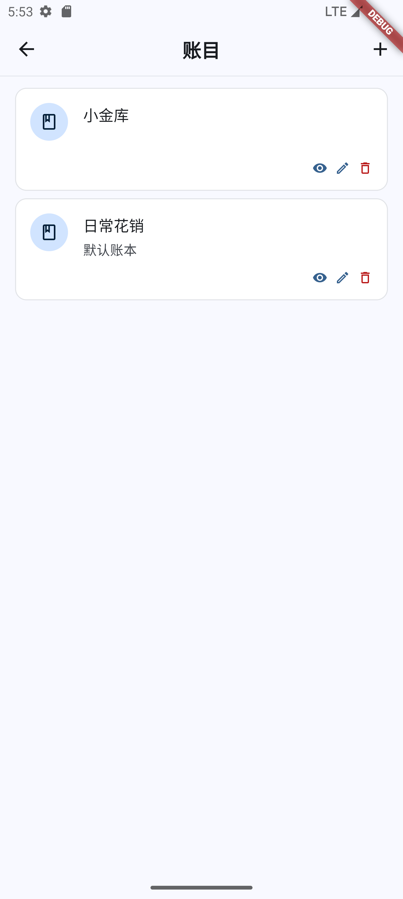
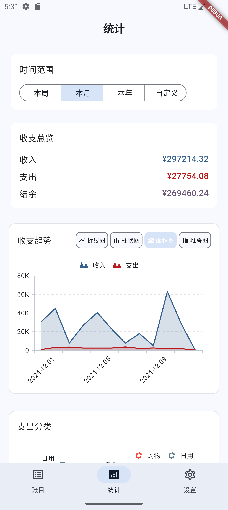

# 记账本 App

一个基于 Flutter 开发的跨平台记账应用(支持英文、简体中文、繁体中文)，是 [clsswjz-server](https://github.com/clssw1004/clsswjz-server) 的前端实现。支持多账本管理、多人协作、资金账户管理等功能。

## 下载安装

访问 [Releases](https://github.com/clssw1004/clsswjz-app/releases) 页面下载最新版本：

### Android

- 下载 `clsswjz-{版本号}-android-arm64.apk`
- 允许安装未知来源的应用
- 直接安装 APK 文件

### Windows

- 下载 `clsswjz-{版本号}-windows-x64.zip`
- 解压到任意目录
- 运行 `clsswjz.exe`

### Linux

- 下载 `clsswjz-{版本号}-linux-x64.zip`
- 解压到任意目录
- 添加执行权限：`chmod +x clsswjz`
- 运行：`./clsswjz`

## 功能特性

### 账目管理

- 收入/支出记录
- 自定义分类管理
- 商家管理
- 资金账户管理
- 多账本支持
- 账目筛选与搜索

### 账本管理

- 创建和管理多个账本
- 成员权限管理
- 账本共享与协作
- 默认账本设置

### 用户系统

- 用户注册与登录
- 个人信息管理
- 邀请码系统
- 后端服务配置

### 统计分析

- 收支总览
- 分类统计
- 趋势分析
- 自定义时间范围

## 技术特性

- Material Design 3 设计规范
- 多平台支持 (Android/iOS/Web/Desktop)
- 响应式布局
- 深色模式支持
- 本地数据缓存
- 实时数据同步

## 开发环境

- Flutter 3.24.5
- Dart SDK 3.3.0
- Android Studio / VS Code
- Android SDK / iOS SDK
